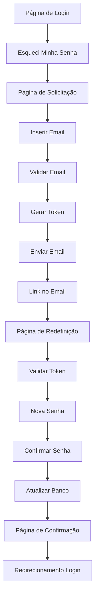

# Sistema de Recuperação de Senha - Documentação Técnica

## 1. Visão Geral do Produto

Sistema seguro de recuperação de senha que permite aos usuários redefinir suas credenciais através de um link temporário enviado por email. O sistema garante segurança através de tokens únicos com expiração e validações robustas, proporcionando uma experiência intuitiva e confiável para recuperação de acesso.

## 2. Funcionalidades Principais

### 2.1 Papéis de Usuário

| Papel | Método de Registro | Permissões Principais |
|-------|-------------------|----------------------|
| Usuário Registrado | Email e senha | Pode solicitar recuperação de senha para sua conta |
| Sistema | Automático | Gera tokens, envia emails e valida solicitações |

### 2.2 Módulos Funcionais

Nosso sistema de recuperação de senha consiste nas seguintes páginas principais:

1. **Página de Solicitação**: formulário de email, botão de envio, validação de entrada.
2. **Página de Redefinição**: formulário de nova senha, validação de token, confirmação de senha.
3. **Página de Confirmação**: mensagem de sucesso, redirecionamento para login.

### 2.3 Detalhes das Páginas

| Nome da Página | Nome do Módulo | Descrição da Funcionalidade |
|----------------|----------------|-----------------------------|
| Página de Solicitação | Formulário de Email | Capturar email do usuário, validar formato, verificar existência no sistema |
| Página de Solicitação | Botão Recuperar Senha | Enviar solicitação, gerar token único, disparar email de recuperação |
| Página de Solicitação | Validação de Entrada | Verificar formato do email, exibir mensagens de erro/sucesso |
| Página de Redefinição | Validação de Token | Verificar validade e expiração do token de recuperação |
| Página de Redefinição | Formulário Nova Senha | Capturar nova senha, validar critérios de segurança, confirmar senha |
| Página de Redefinição | Processamento Seguro | Hash da nova senha, atualização no banco, invalidação do token |
| Página de Confirmação | Mensagem de Sucesso | Confirmar redefinição bem-sucedida, orientar próximos passos |
| Página de Confirmação | Redirecionamento | Redirecionar automaticamente para página de login após 3 segundos |

## 3. Processo Principal

**Fluxo do Usuário para Recuperação de Senha:**

1. Usuário acessa a página de login e clica em "Esqueci minha senha"
2. Sistema redireciona para página de solicitação de recuperação
3. Usuário insere seu email cadastrado e clica em "Recuperar Senha"
4. Sistema valida se o email existe na base de dados
5. Sistema gera token único com expiração de 15 minutos
6. Sistema envia email com link de recuperação contendo o token
7. Usuário acessa o link recebido por email
8. Sistema valida o token e redireciona para página de redefinição
9. Usuário insere nova senha e confirmação
10. Sistema valida critérios de segurança da senha
11. Sistema atualiza a senha com hash seguro e invalida o token
12. Sistema exibe confirmação e redireciona para login

## 4. Design da Interface do Usuário

### 4.1 Estilo de Design

- **Cores Primárias**: #2563eb (azul principal), #1e40af (azul escuro)
- **Cores Secundárias**: #f3f4f6 (cinza claro), #ef4444 (vermelho erro), #10b981 (verde sucesso)
- **Estilo de Botões**: Arredondados (border-radius: 8px) com efeito hover
- **Fonte**: Inter, sans-serif com tamanhos 14px (corpo), 18px (títulos), 24px (cabeçalhos)
- **Layout**: Design centrado com cards, navegação superior limpa
- **Ícones**: Lucide React para consistência visual (mail, lock, check-circle)

### 4.2 Visão Geral do Design das Páginas

| Nome da Página | Nome do Módulo | Elementos da UI |
|----------------|----------------|----------------|
| Página de Solicitação | Formulário de Email | Card centralizado, campo de input com ícone de email, botão azul destacado, texto explicativo claro |
| Página de Solicitação | Validação Visual | Mensagens de erro em vermelho, sucesso em verde, loading spinner durante processamento |
| Página de Redefinição | Formulário de Senha | Card seguro, campos de senha com toggle de visibilidade, indicador de força da senha |
| Página de Redefinição | Validação de Critérios | Lista de critérios com checkmarks visuais, feedback em tempo real |
| Página de Confirmação | Mensagem de Sucesso | Ícone de check grande, texto de confirmação, contador de redirecionamento |

### 4.3 Responsividade

Design mobile-first com adaptação para desktop. Otimizado para interação touch em dispositivos móveis, com botões de tamanho adequado (mínimo 44px) e espaçamento confortável entre elementos.