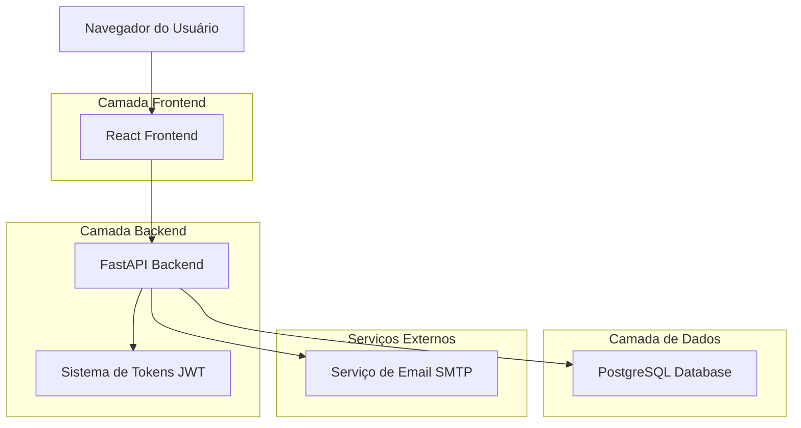
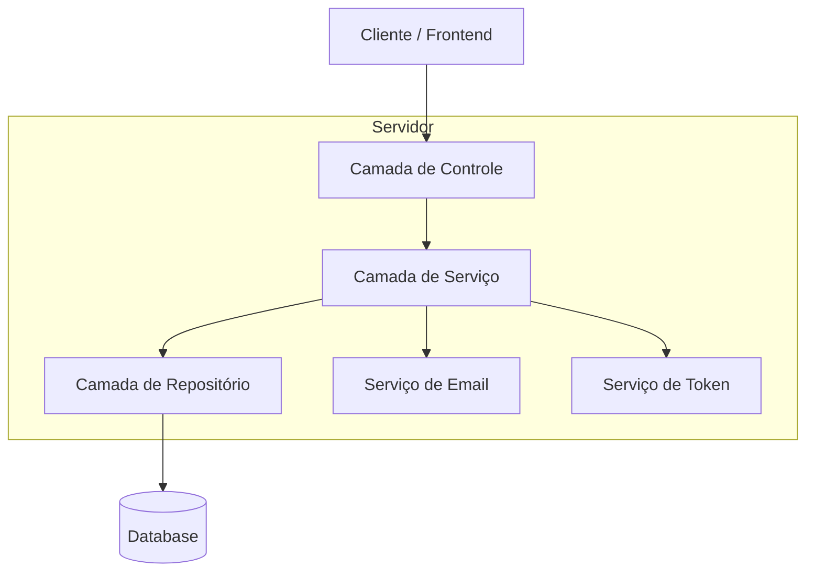
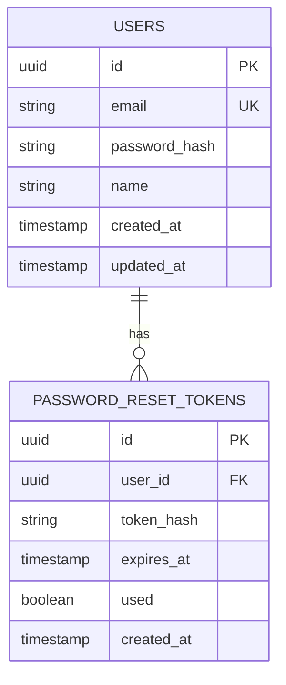

# Arquitetura Técnica - Sistema de Recuperação de Senha

## 1. Arquitetura do Sistema



## 2. Descrição das Tecnologias

- Frontend: React@18 + TypeScript + Tailwind CSS + React Router
- Backend: FastAPI + Python 3.9+ + Pydantic + SQLAlchemy
- Database: PostgreSQL (via Supabase)
- Email: SMTP (Gmail/SendGrid)
- Autenticação: JWT + bcrypt para hash de senhas

## 3. Definições de Rotas

| Rota | Propósito |
|------|----------|
| /forgot-password | Página de solicitação de recuperação de senha |
| /reset-password/:token | Página de redefinição de senha com token |
| /reset-success | Página de confirmação de redefinição bem-sucedida |
| /login | Página de login (com link para recuperação) |

## 4. Definições de API

### 4.1 APIs Principais

**Solicitação de recuperação de senha**
```
POST /api/auth/forgot-password
```

Request:
| Nome do Parâmetro | Tipo | Obrigatório | Descrição |
|-------------------|------|-------------|----------|
| email | string | true | Email do usuário cadastrado |

Response:
| Nome do Parâmetro | Tipo | Descrição |
|-------------------|------|----------|
| success | boolean | Status da operação |
| message | string | Mensagem de feedback |

Exemplo:
```json
{
  "email": "usuario@exemplo.com"
}
```

**Validação de token de recuperação**
```
GET /api/auth/validate-reset-token/:token
```

Response:
| Nome do Parâmetro | Tipo | Descrição |
|-------------------|------|----------|
| valid | boolean | Se o token é válido e não expirou |
| message | string | Mensagem de status |

**Redefinição de senha**
```
POST /api/auth/reset-password
```

Request:
| Nome do Parâmetro | Tipo | Obrigatório | Descrição |
|-------------------|------|-------------|----------|
| token | string | true | Token de recuperação |
| new_password | string | true | Nova senha do usuário |
| confirm_password | string | true | Confirmação da nova senha |

Response:
| Nome do Parâmetro | Tipo | Descrição |
|-------------------|------|----------|
| success | boolean | Status da operação |
| message | string | Mensagem de feedback |

Exemplo:
```json
{
  "token": "eyJhbGciOiJIUzI1NiIsInR5cCI6IkpXVCJ9...",
  "new_password": "novaSenha123!",
  "confirm_password": "novaSenha123!"
}
```

## 5. Arquitetura do Servidor



## 6. Modelo de Dados

### 6.1 Definição do Modelo de Dados



### 6.2 Linguagem de Definição de Dados

**Tabela de Tokens de Recuperação (password_reset_tokens)**
```sql
-- Criar tabela
CREATE TABLE password_reset_tokens (
    id UUID PRIMARY KEY DEFAULT gen_random_uuid(),
    user_id UUID NOT NULL,
    token_hash VARCHAR(255) NOT NULL,
    expires_at TIMESTAMP WITH TIME ZONE NOT NULL,
    used BOOLEAN DEFAULT FALSE,
    created_at TIMESTAMP WITH TIME ZONE DEFAULT NOW(),
    FOREIGN KEY (user_id) REFERENCES users(id) ON DELETE CASCADE
);

-- Criar índices
CREATE INDEX idx_password_reset_tokens_user_id ON password_reset_tokens(user_id);
CREATE INDEX idx_password_reset_tokens_token_hash ON password_reset_tokens(token_hash);
CREATE INDEX idx_password_reset_tokens_expires_at ON password_reset_tokens(expires_at);
CREATE INDEX idx_password_reset_tokens_used ON password_reset_tokens(used);

-- Política de segurança Supabase
ALTER TABLE password_reset_tokens ENABLE ROW LEVEL SECURITY;

-- Permitir acesso apenas ao backend autenticado
CREATE POLICY "Backend access only" ON password_reset_tokens
    FOR ALL USING (auth.role() = 'service_role');

-- Limpeza automática de tokens expirados (função)
CREATE OR REPLACE FUNCTION cleanup_expired_tokens()
RETURNS void AS $$
BEGIN
    DELETE FROM password_reset_tokens 
    WHERE expires_at < NOW() OR used = TRUE;
END;
$$ LANGUAGE plpgsql;

-- Trigger para limpeza automática
CREATE OR REPLACE FUNCTION trigger_cleanup_tokens()
RETURNS trigger AS $$
BEGIN
    PERFORM cleanup_expired_tokens();
    RETURN NEW;
END;
$$ LANGUAGE plpgsql;

CREATE TRIGGER cleanup_tokens_trigger
    AFTER INSERT ON password_reset_tokens
    EXECUTE FUNCTION trigger_cleanup_tokens();
```

**Especificações de Segurança:**

1. **Geração de Tokens**: Tokens JWT com payload mínimo, assinados com chave secreta forte
2. **Expiração**: 15 minutos para máxima segurança
3. **Hash de Tokens**: Tokens são hasheados antes de armazenar no banco
4. **Rate Limiting**: Máximo 3 tentativas por email por hora
5. **Validação de Email**: Verificação de existência antes de gerar token
6. **Hash de Senha**: bcrypt com salt rounds >= 12
7. **Uso Único**: Tokens invalidados após uso ou expiração
8. **Limpeza Automática**: Remoção de tokens expirados do banco

**Critérios de Senha:**
- Mínimo 8 caracteres
- Pelo menos 1 letra maiúscula
- Pelo menos 1 letra minúscula
- Pelo menos 1 número
- Pelo menos 1 caractere especial

**Configurações de Email:**
- Template HTML responsivo
- Link com domínio verificado
- Texto alternativo para clientes sem HTML
- Timeout de 30 segundos para envio